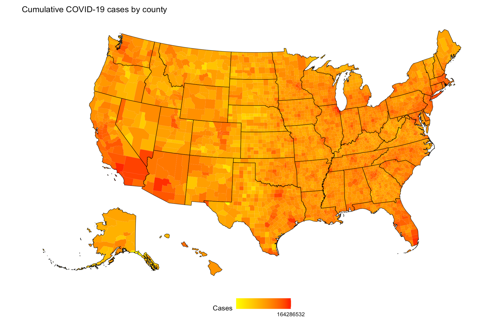

```{r setup, include=FALSE}
options(htmltools.dir.version = FALSE)##, htmltools.preserve.raw = FALSE)
```

# Line Graphs

My data comes from Federal Reserve Economic Data (FRED), US Census data, COVID Tracking data, and USA Facts data

---

# R Code

```{r comment='#', include= FALSE}
library(tidyr)
library(fredr)
library(ggplot2)
library(knitr)
library(reshape2)    
#SETTING UP
fredr_set_key("bf2bcfa30bca51b9d589467640fc2ff3")
fredr_series_search_text(
  search_text = "unemployment",
  limit = 100L
)

#Importing
ur0 <- fredr(
  series_id = "UNRATE",
  observation_start = as.Date("2020-01-01")
)

pcenofood0 <- fredr(
  series_id = "PCEPILFE",
  observation_start = as.Date("2020-01-01")
)

pceindex0 <- fredr(
  series_id = "PCEPI",
  observation_start = as.Date("2020-01-01")
)

psr0 <- fredr(
  series_id = "PSAVERT",
  observation_start = as.Date("2020-01-01")
)

pce0 <- fredr(
  series_id = "PCEC96", #REALPCE
  observation_start = as.Date("2020-01-01")
)
pcepercent0 <- fredr(
  series_id = "DPCCRAM1M225NBEA",
  observation_start = as.Date("2020-01-01")
)
library(plotly)
ur0 <- ur0[-c(15),]
ur0 <- ur0[, 1:3]
ur0 <- ur0[, -2]
names(ur0)[2] <- "UR"
psr0 <- psr0[, 1:3]
psr0 <- psr0[, -2]
names(psr0)[2] <- "PSR"
tst01 <- cbind(psr0, ur0)
tst01 <- tst01[, -3]
rownames(tst01) <- 1:15
colnames(tst01) <- c("d", "PSR", "UR")
mm0 = melt(tst01, id='d')
```
```{r comment='#'}
psrurgr03 <- ggplot(data = mm0, aes(x=d, y=value, color=variable)) + geom_line() + theme(axis.text.x = element_text(angle = 30, vjust = 1, hjust=0)) + xlab("Month") + ylab("Rate") + ggtitle("Unemployment Rate and Personal Saving Rate Over Time")
ggplotly(psrurgr03)
```

---
```{r, include = FALSE}
pcepercent0 <- pcepercent0[, -2]
pcepercent0 <- pcepercent0[, 1:2]
names(pcepercent0)[2] <- "PCE PercentChng"
tst02 <- cbind(psr0, ur0, pcepercent0)
rownames(tst02) <- 1:15
tst02 <- tst02[, -3]
tst02 <- tst02[, -4]
mm02 = melt(tst02, id='date')
wpcegr0 <- ggplot(mm02)+geom_line(aes(x=date, y=value, color=variable)) + xlab("Month") + ylab("Rate") + ggtitle("PSR, UR, PCE (as percent change) Over Time") + theme(axis.text.x = element_text(angle = 30, vjust = 1, hjust=0))
```
```{r}
ggplotly(wpcegr0)
```
---

```{r, include=FALSE}
library(data.table)

realpce0 <- fredr(
  series_id = "PCEC96",
  observation_start = as.Date("2020-01-01")
)
realpce0 <- realpce0[,-2]
realpce0 <- realpce0[1:2]
names(realpce0)[2] <- "RealPCE"

realpceeegs0 <- fredr( #realpce energy goods and services
    series_id = "DNRGRX1M020SBEA",
    observation_start = as.Date("2020-01-01")
  )
realpceeegs0 <- realpceeegs0[,-2]
realpceeegs0 <- realpceeegs0[1:2]
names(realpceeegs0)[2] <- "PCEEnergy"

realpcegoods0 <- fredr( #general goods
  series_id = "DGDSRX1",
  observation_start = as.Date("2020-01-01")
)
realpcegoods0 <- realpcegoods0[,-2]
realpcegoods0 <- realpcegoods0[1:2]
names(realpcegoods0)[2] <- "PCEGenGoods"

realpcenondur0 <- fredr( #nondurable goods
  series_id = "PCENDC96",
  observation_start = as.Date("2020-01-01")
)
realpcenondur0 <- realpcenondur0[,-2]
realpcenondur0 <- realpcenondur0[1:2]
names(realpcenondur0)[2] <- "PCENondurableGoods"

realpcesrv0 <- fredr( #services
  series_id = "PCESC96",
  observation_start = as.Date("2020-01-01")
)
realpcesrv0 <- realpcesrv0[,-2]
realpcesrv0 <- realpcesrv0[1:2]
names(realpcesrv0)[2] <- "PCEServices"

realpcedur0 <- fredr( #durable goods
  series_id = "PCEDGC96",
  observation_start = as.Date("2020-01-01")
)
realpcedur0 <- realpcedur0[,-2]
realpcedur0 <- realpcedur0[1:2]
names(realpcedur0)[2] <- "PCEDurableGoods"

realpcefd0 <- fredr( #food
  series_id = "DFXARX1M020SBEA",
  observation_start = as.Date("2020-01-01")
)
realpcefd0 <- realpcefd0[,-2]
realpcefd0 <- realpcefd0[1:2]
names(realpcefd0)[2] <-"PCEFood"

combinedpces02 <- cbind(realpce0, realpcedur0, realpceeegs0, realpcefd0, realpcegoods0, realpcenondur0, realpcesrv0)
combinedpces02 <- combinedpces02[, -3]
combinedpces02 <- combinedpces02[, -4]
combinedpces02 <- combinedpces02[, -5]
combinedpces02 <- combinedpces02[, -6]
combinedpces02 <- combinedpces02[, -7]
combinedpces02 <- combinedpces02[, -8]
meltedpce0 <- melt(combinedpces02, id='date')
```
```{r}
pcecats0 <- ggplot(meltedpce0)+geom_line(aes(x=date,y = value, color=variable)) + 
  theme(axis.text.x = element_text(angle = 30, vjust = 1, hjust=0)) + xlab("Month") + 
  ylab("Index") + ggtitle("Various Personal Consumption Expenditure categories over time")
ggplotly(pcecats0)
```
---
```{r, echo = FALSE, include=FALSE}
library(scales)
library(readxl)
#data from https://covidtracking.com/data/download
national_history_1_ <- read_excel("national-history(1).xlsx") 
covid0 <- national_history_1_
covid0 <- (setattr(covid0, "col.names", c("date", "death", "deathIncrease", "incluCumulative", "incluCurrently", "hospitalizedInc", "hospitalizedCurr", "hospitalizedCumul", "negative", "negativeIncrease", "onVentilarCumul", "onVentilatorCurr", "positive", "positiveInc", "states", "totTestResults", "totTestResInc")))
colnames(covid0) <- c("date", "death", "deathIncrease", "incluCumulative", "incluCurrently", "hospitalizedInc", "hospitalizedCurr", "hospitalizedCumul", "negative", "negativeIncrease", "onVentilarCumul", "onVentilatorCurr", "positive", "positiveInc", "states", "totTestResults", "totTestResInc")
covid0$positiveInc <- as.numeric(covid0$positiveInc)
covid0$date <- as.Date(covid0$date, "%Y-%m-%d", origin = "2020-01-13")
posicgr0 <- ggplot(covid0) + geom_line(aes(x=date, y = positiveInc, group = 2)) + scale_y_continuous(labels = comma) + xlab("Month") + ylab("Positive Cases") + ggtitle("Positive COVID-19 Tests Over Time")
```
```{r}
ggplotly(posicgr0 + theme_minimal(base_size = 14, base_family = "Georgia"))
```
---
```{r, echo = FALSE, message=FALSE, include = FALSE}
library(dplyr)
library(lubridate)
covidtestdf0 <- aggregate(covid0["positiveInc"], by=covid0["date"], sum) #line186, original data
DT0<- data.table(covidtestdf0) #line 200
DT0[,sum(positiveInc),by = date]
DT0 <- DT0 %>% group_by(month=floor_date(date, "month")) %>%
  summarize(positiveInc=sum(positiveInc))
aggposinc0 <- ggplot(DT0, aes(x=month, y = positiveInc)) + geom_line() + scale_y_continuous(labels = comma) + xlab("Month") + ylab("Positive Cases") + ggtitle("Positive COVID-19 Tests Over Time")

```
```{r}
ggplotly(aggposinc0)
```

---
```{r, echo = FALSE, message=FALSE}
pceindex0$date <- as.Date(pceindex0$date)
subz0 <- pceindex0
subz0 <- pceindex0[(4),]
pceplot0 <- ggplot(pceindex0, aes(x = date, y = value)) +
  xlab("Date") +
  ylab("PCE") +
  theme_minimal(base_size = 14, base_family = "Georgia") + geom_point() + geom_line() + geom_point(data = subz0, color = "red") + geom_text(data=subz0, label="Stimulus Check Distribution", vjust=0.5) + ggtitle("PCE over time") #geom_text(data = pceindex, aes(x = date, label = "my label")) 
```
```{r}
ggplotly(pceplot0)
```
---
```{r, echo = FALSE, message=FALSE}
engdot0 <- realpceeegs0[c(4),]
energypce0 <- ggplot(realpceeegs0, aes(x = date, y = PCEEnergy)) +  xlab("Date") +
  ylab("Energy PCE") + theme_minimal(base_size = 14, base_family = "Georgia") + geom_line() + geom_point() + geom_text(data=engdot0, label="Stimulus Check Distribution", vjust=0.5) + geom_point(data = engdot0, color = "red")
```
```{r}
ggplotly(energypce0 + ggtitle("Energy PCE over time"))
```
---
```{r, echo = FALSE, message=FALSE, warning=FALSE}
dtcov0 <- DT0[-c(15), ] #line 201
colnames(dtcov0) <- c("date", "positiveInc")
realpceeegsn0 <- realpceeegs0[-c(15),]
realenggr01 <- cbind(dtcov0, realpceeegsn0)
realenggr02 <- melt(realenggr01, id = "date")  
require(scales)
subz02 <- realenggr02[c(18),]
test00 <- ggplot(realenggr02, aes(x=date,y = value, color=variable)) + xlab("Date") + theme_minimal(base_size = 14, base_family = "Georgia") + geom_point() + geom_line() + theme(axis.text.x = element_text(angle = 30, vjust = 1, hjust=0)) + facet_wrap(~variable,scales = "free_y") + scale_y_continuous(labels = comma) + geom_point(data = subz02, color = "red") + geom_text(data=subz02, label="Stimulus Check Distribution", vjust=0.5)

```
```{r}
testinteractive0 <- ggplotly(test00 + xlab("\nMonth") + theme(axis.title.x = element_text(vjust= -5)) + theme(axis.title.x = element_text(hjust= -5)) + ylab("Value") + ggtitle("Energy PCE vs COVID-19 rates over time"))
testinteractive0
```
---

#Scatterplots

```{r}
scatt <- ggplot(realenggr02, aes(x=date,y = value, color=variable)) + xlab("Date") + theme_minimal(base_size = 14, base_family = "Georgia") + geom_point()+ theme(axis.text.x = element_text(angle = 30, vjust = 1, hjust=0)) + scale_y_continuous(labels = comma) + facet_wrap(~variable,scales = "free_y") 
scatt

```
---
```{r, echo = FALSE, message=FALSE, warning =FALSE}
dtcov00 <- DT0[-c(15), ]
colnames(dtcov00) <- c("date", "positiveInc")
pce02 <- pce0[, -2]
pce02 <- pce02[, 1:2]
pcen02 <- pce02[-c(15),]
pcescatt01 <- cbind(dtcov00, pcen02)
pcescatt02 <- melt(pcescatt01, id = "date")  

```
```{r}
scatt3 <- ggplot(pcescatt02, aes(x=date,y = value, color=variable)) + xlab("Date") + theme_minimal(base_size = 14, base_family = "Georgia") + geom_point()+ theme(axis.text.x = element_text(angle = 30, vjust = 1, hjust=0)) + scale_y_continuous(labels = comma) +facet_wrap(~variable,scales = "free_y") 
scatt3
```
---
```{r, echo = FALSE, message=FALSE, warning=FALSE}
psrn0 <- psr0[-c(15),] #line 58, original import from FRED
psrcovdt0 <-cbind(dtcov0, psrn0) #lines 236 and 276
psrcovdt02 <- melt(psrcovdt0, id = "date")

```
```{r}
scatt02 <- ggplot(psrcovdt02, aes(x=date,y = value, color= variable)) + xlab("Date") + theme_minimal(base_size = 14, base_family = "Georgia") + geom_point()+ theme(axis.text.x = element_text(angle = 30, vjust = 1, hjust=0)) + scale_y_continuous(labels = comma) + facet_wrap(~variable,scales = "free_y") 
scatt02

```
---

#Correlations and regressions
```{r, echo = FALSE, message=FALSE, include=FALSE}
DT03 <- DT0[-15, ]
```
```{r}
cor.test(DT03$positiveInc, pcen02$value)
```
---
```{r, echo = FALSE, message=FALSE, include=FALSE}
psrcovdt03 <- psrcovdt0[, -3] #from earlier dataset line 277
psrcovdt04 <- psrcovdt03
psrcovdt04$PCE <- pcescatt01[, 4]
psrcovdt05 <- psrcovdt04[, -1]
summary(psrcovdt05)
library(olsrr)
reg2 <- lm(PCE ~., data = psrcovdt05) 
stepall <- ols_step_all_possible(reg2)
ols_step_best_subset(reg2)
summary(stepall)
stepall
```
```{r}
regT <- lm(PCE ~ PSR * positiveInc, data = psrcovdt05)
```
```{r, echo=FALSE, message = FALSE, warning= FALSE}
library(huxtable)
huxreg(regT)
```
---
```{r}
regCP <- lm(log(PCE) ~ PSR + positiveInc, data = psrcovdt05)
```
```{r, echo=FALSE, message = FALSE, warning = FALSE}
huxreg(regCP)
```
```{r, include=FALSE}
anova(regT, regCP)
```
---

# Maps
```{r, echo = FALSE, message=FALSE, include = FALSE}
library(maps)
library(mapproj)
library(readxl)
export <- read_excel("lklyvacc.xlsx")
lklyvacc0 <- export
colnames(lklyvacc0) <- c("week", "area", "totalPopOver18", "measureUniverse", "number", "marginOfError", "percent", "percentMargOfErr")
lklyvacc0 <- lklyvacc0[-c(1),]
lklyvacc0$region <- tolower(lklyvacc0$area)
states0 <- map_data("state")
lklyvacc0$percent <- as.numeric(lklyvacc0$percent)
map.df0 <- as.data.frame(lklyvacc0)
map.df0$percent <- as.numeric(map.df0$percent)
map.df0 <- merge(states0,lklyvacc0, by="region", all.x=T)
map.df0 <- map.df0[order(map.df0$order),]
```
```{r, fig.show = 'hide'}
w0 <- ggplot(map.df0, aes(x=long,y=lat,group=group))+
  geom_polygon(aes(fill=percent))+
  geom_path()+ 
  scale_fill_gradientn(colours=rev(heat.colors(10)),na.value="grey90")+
  coord_map() + ggtitle("Percentage of people who said they are likely to receive a vaccine by state")
w0
```
---

```{r pressure, echo=FALSE, out.width = '100%'}

```

---


---


---


---

class: center, middle

# Thanks!

Slides created via the R package [**xaringan**](https://github.com/yihui/xaringan).
